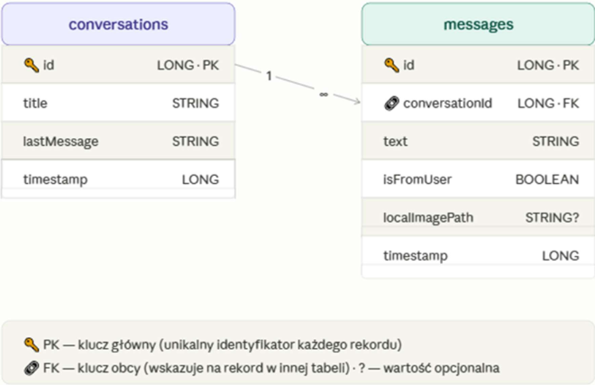
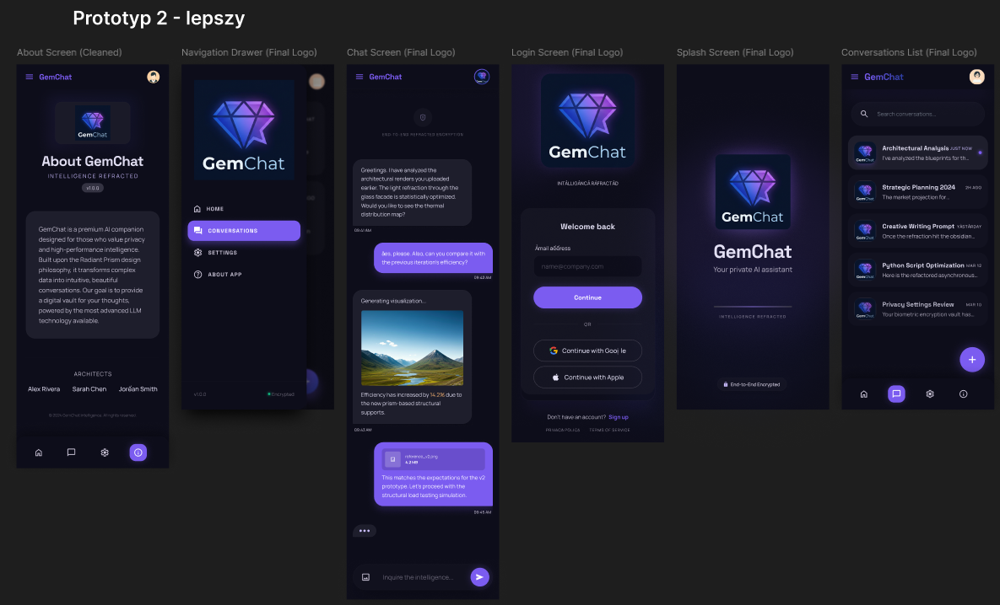
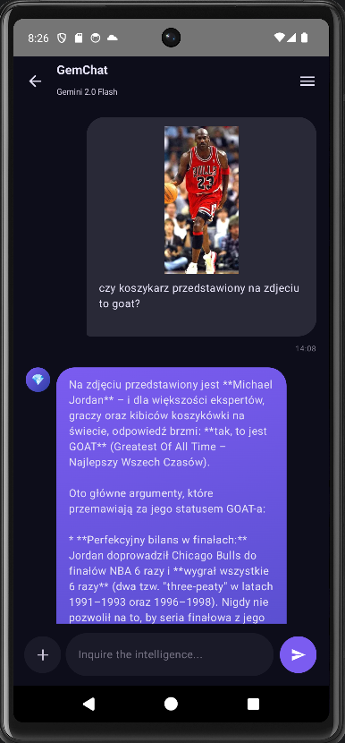
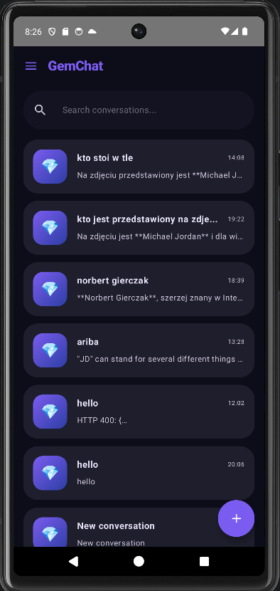
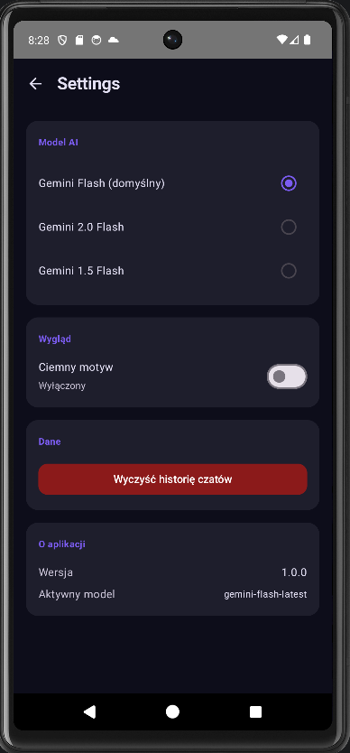
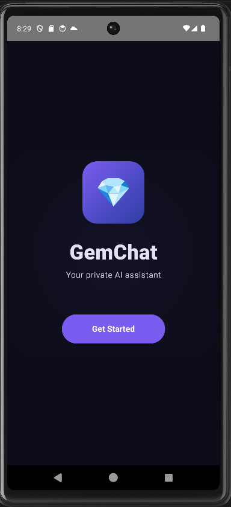
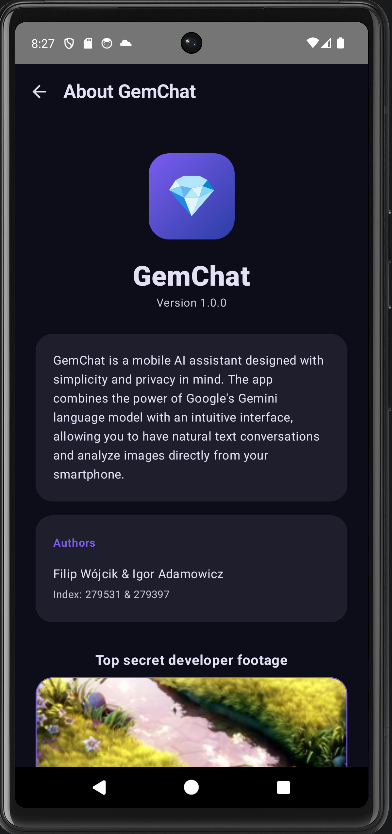

# GemChat - Twój Prywatny Asystent AI 💎

GemChat to zaawansowana aplikacja mobilna na system Android, działająca jako inteligentny asystent oparty na modelu **Google Gemini**. Projekt wyróżnia się pełnym wsparciem dla multimodalności (analiza tekstu i obrazu) oraz bezkompromisowym podejściem do prywatności użytkownika (architektura *Local-First*).

## 🌟 Kluczowe Funkcje

*   **Multimodalny Czat (Tekst + Vision):** Prowadź naturalne konwersacje z AI. Aplikacja pozwala na przesyłanie zdjęć bezpośrednio z galerii urządzenia – model zinterpretuje obraz i odpowie na pytania z nim związane.
*   **Prywatność (Privacy-by-Design):** Żadne dane konwersacji nie są wysyłane na zewnętrzne serwery bazodanowe. Cała historia czatów, załączniki oraz metadane są bezpiecznie przechowywane w izolowanej, lokalnej bazie Room na urządzeniu użytkownika.
*   **Zarządzanie Sesjami:** 
    *   Automatyczne grupowanie wiadomości w wątki (Conversations).
    *   Możliwość przeglądania historii, wznawiania starszych rozmów oraz ich usuwania.
*   **Personalizacja i Multimedia:**
    *   Efektowna animacja startowa z obracającym się diamentem 💎.
    *   Zintegrowany odtwarzacz wideo w sekcji "About" korzystający z Jetpack Media3.
    *   Obsługa dynamicznego motywu (Dark/Light mode).

## 🗄 Struktura Danych (Room Database)

Schemat bazy danych został zaprojektowany tak, aby umożliwić relacyjne powiązanie konwersacji z ich treścią, zachowując spójność danych:

*   **conversations:** Przechowuje informacje o wątkach czatu, w tym wygenerowany tytuł, skrót ostatniej wiadomości oraz znacznik czasu ostatniej aktywności.
*   **messages:** Przechowuje szczegóły każdej wiadomości. Każdy wpis zawiera treść tekstową, informację o autorze (użytkownik/AI), opcjonalną ścieżkę do lokalnie zapisanego zdjęcia oraz powiązanie z ID konwersacji.

<div style="display: flex; gap: 10px;">
  
</div>

## 🛠 Szczegóły Techniczne

### Implementacja AI (Google Gemini API)

Aplikacja integruje model **Gemini 2.0 Flash** za pomocą oficjalnego SDK Google, co pozwala na błyskawiczne generowanie odpowiedzi:

*   **Multimodalność:** Obrazy wybrane przez użytkownika są konwertowane na format Base64 i przesyłane bezpośrednio w zapytaniu JSON jako `inline_data`.
*   **Zarządzanie Stanem:** Repozytorium utrzymuje lokalną listę historii sesji, dzięki czemu AI "pamięta" kontekst poprzednich wiadomości w danej rozmowie.
*   **Prywatność Zdjęć:** Zdjęcia z galerii są kopiowane do prywatnego folderu aplikacji (`filesDir`), co gwarantuje ich dostępność nawet po restarcie systemu bez konieczności ciągłego proszenia o uprawnienia do galerii.

### Architektura ViewModel

Aplikacja została zbudowana zgodnie z zasadami **Clean Architecture** przy użyciu komponentów architekturalnych Android Jetpack.

*   **Separacja logiki:** `ChatViewModel` służy jako jedyne źródło prawdy dla widoku. Odpowiada za przygotowanie danych do wyświetlenia (strumienie wiadomości) oraz obsługę akcji użytkownika (wysyłanie, dodawanie zdjęć).
*   **Reaktywność (Flow):** ViewModel udostępnia strumienie danych z bazy Room przy użyciu `Flow`. Dzięki temu, gdy AI wygeneruje odpowiedź i zostanie ona zapisana w bazie, interfejs czatu odświeża się automatycznie.
*   **Coroutines (Współbieżność):** Wszystkie operacje na bazie danych, kopiowanie plików graficznych oraz zapytania sieciowe do API Gemini odbywają się w tle za pomocą `viewModelScope`. Zapobiega to blokowaniu głównego wątku (UI).
*   **Warstwa Repository:** ViewModel nie komunikuje się bezpośrednio z bazą danych ani z siecią. Korzysta z repozytoriów, które decydują o przepływie informacji.

## 📡 Strumienie danych w ViewModel

### ChatViewModel
W tym modelu strumienie zarządzają danymi dotyczącymi aktywnej rozmowy:
*   **messages (Flow<List<Message>>):** Główny strumień emitujący listę wszystkich wiadomości w aktualnym czacie. Służy do renderowania bąbelków wiadomości.
*   **isLoading (StateFlow<Boolean>):** Informuje UI o trwającym generowaniu odpowiedzi przez AI, co pozwala na wyświetlenie animacji trzech kropek (Typing Indicator).

## ⚙️ Metody w ViewModel

### ChatViewModel
*   **sendMessage(text, imageUri, context):** Główna funkcja logiczna. Zapisuje zdjęcie lokalnie, dodaje wiadomość użytkownika do bazy, wysyła zapytanie do Gemini API i finalnie zapisuje odpowiedź AI w bazie danych.
*   **saveImageLocally(context, uri):** Funkcja pomocnicza kopiująca plik z galerii do pamięci wewnętrznej aplikacji, zwracając stałą ścieżkę do pliku.

## 📂 Warstwa Repozytorium

### ChatRepository
Zarządza lokalną persystencją danych w SQLite:
*   **getMessagesForConversation(id):** Zwraca reaktywny strumień wiadomości dla wybranego wątku.
*   **insertMessage(...) / updateLastMessage(...):** Obsługuje zapisywanie nowych interakcji i aktualizację podglądu na liście głównej.
*   **deleteAllData():** Funkcja używana w ustawieniach do całkowitego wyczyszczenia pamięci aplikacji.

### GeminiRepository
Odpowiada za logikę komunikacji z chmurą AI:
*   **sendMessage(text, imageBase64, mimeType):** Formatuje zapytanie do API Google, dołącza historię rozmowy (kontekst) oraz opcjonalne dane binarne obrazu.

---

## 🚀 Uruchomienie Projektu

Aby aplikacja mogła łączyć się z modelem, wymaga własnego klucza API.
1. Wygeneruj klucz w panelu [Google AI Studio](https://aistudio.google.com/).
2. W głównym katalogu projektu zlokalizuj plik `local.properties`.
3. Dodaj w nim linijkę:
   ```properties
   GEMINI_API_KEY=twoj_wygenerowany_klucz_tutaj
   ```
4. Zbuduj projekt w Android Studio (wymagany Gradle 8.0+).

---
## Mockups
<div style="display: flex; gap: 10px;">
  
</div>

## Navigation
<div style="display: flex; gap: 10px;">
  
</div>

## ✨ Efekt końcowy (Zrzuty ekranu)

<div style="display: flex; gap: 10px;">
  
  
  
  
  
</div>
